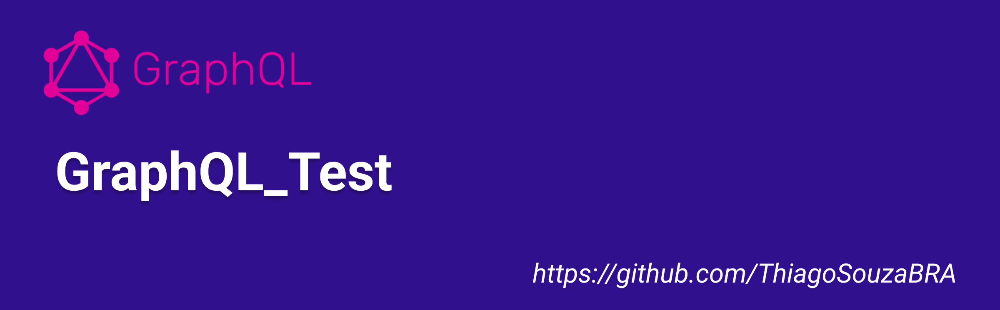

# GraphQL Test


Este projeto demonstra a criação de uma API GraphQL usando Express. Inclui um esquema básico, resolvers e exemplos de consultas.

## Pré-requisitos

- Node.js
- NPM (Node Package Manager)

## Instalação

1. Clone o repositório:
   ```bash
   git clone https://github.com/ThiagoSouzaBRA/GraphQL_Test.git
